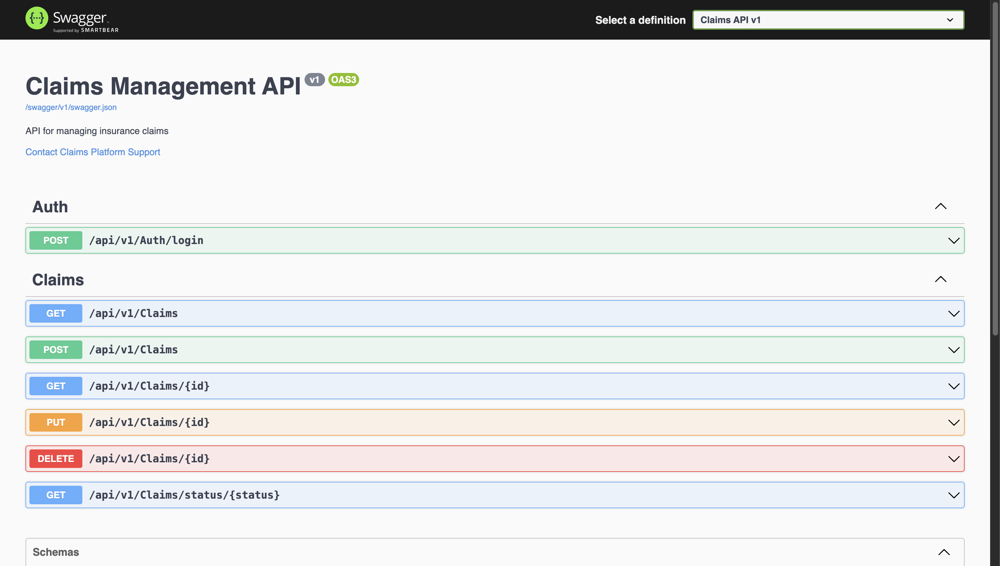

# Claims Management Platform

This full-stack application provides a modern reference implementation for an insurance claims management platform. It demonstrates professional, business-focused software development across the entire stack using a realistic enterprise technology mix.

<br>


---

## 🛠️ Tech Stack Alignment

This project was built to precisely match the technical requirements of the target role.

| Requirement                 | Implementation                                            | Status      |
| --------------------------- | --------------------------------------------------------- | ----------- |
| **C# / .NET Core**          | ASP.NET Core 8.0 Web API with C#                          | ✅ Complete |
| **Angular / React**         | Angular 17+ with TypeScript                               | ✅ Complete |
| **SQL Server**              | Entity Framework Core with SQL Server & Stored Procedures | ✅ Complete |
| **Web APIs / REST**         | Full REST API with GET, POST, PUT, DELETE endpoints       | ✅ Complete |
| **Unit Testing**            | xUnit test suite for the service layer                    | ✅ Complete |
| **Front-End (HTML/CSS/JS)** | Angular components with a professional, clean UI          | ✅ Complete |
| **DevOps**                  | Docker support for SQL Server, Git-ready structure        | ✅ Complete |

## ✨ Key Features

- **Full CRUD Operations** for claims management.
- **RESTful API Backend** with controllers, services, and repository patterns.
- **Database Integration** using Entity Framework Core (Code-First) and raw SQL Stored Procedures.
- **Single-Page Application (SPA)** frontend built with Angular.
- **Reactive Forms** with validation for a smooth user experience.
- **Backend Unit Testing** with xUnit to ensure business logic correctness.
- **Swagger/OpenAPI** for interactive API documentation.

---

## 🚀 Quick Start

A brief guide to get the application running. For detailed instructions, see the [**Full Setup Guide**](./instructions/manuals/SETUP.md).

### 1. Start the Backend API

```bash
cd VerusClaims.API
dotnet run
```

The API will be available at `https://localhost:5001`.

### 2. Start the Frontend App

In a new terminal:

```bash
cd VerusClaims.Client
npm install # First time only
npm start
```

The application will be available at `http://localhost:4200`.

---

## 📄 API Documentation

The backend includes Swagger for interactive API documentation and testing.

<br>




---

## 💡 Resume & Interview Highlights

Use these points to describe the project on your resume or in an interview.

1.  **"Built a full-stack Claims Management System using a C# ASP.NET Core Web API and an Angular frontend."**

    - _Demonstrates end-to-end development capability._

2.  **"Implemented RESTful APIs with Entity Framework Core and optimized complex queries with raw SQL stored procedures."**

    - _Shows deep database expertise with both ORM and SQL._

3.  **"Developed a robust unit test suite using xUnit for the backend service layer to ensure code quality and reliability."**

    - _Directly addresses the need for professional testing practices._

4.  **"Designed and built a professional, business-focused UI with Angular and modern reactive forms."**
    - _Highlights practical, business-oriented frontend skills over academic ones._
